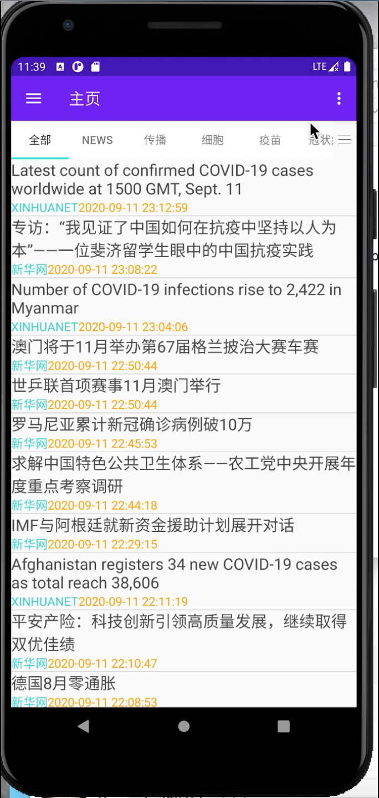
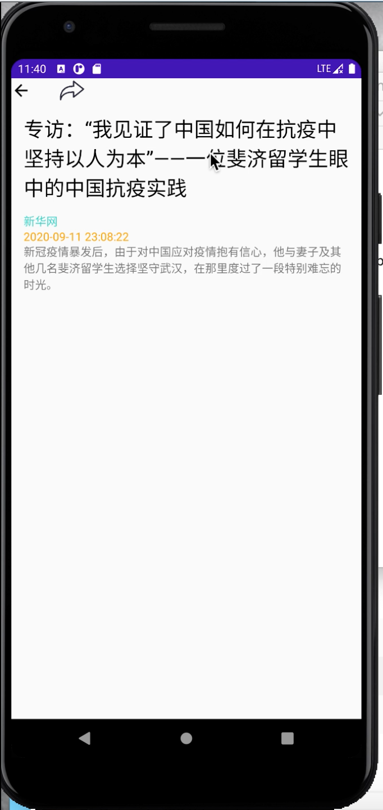
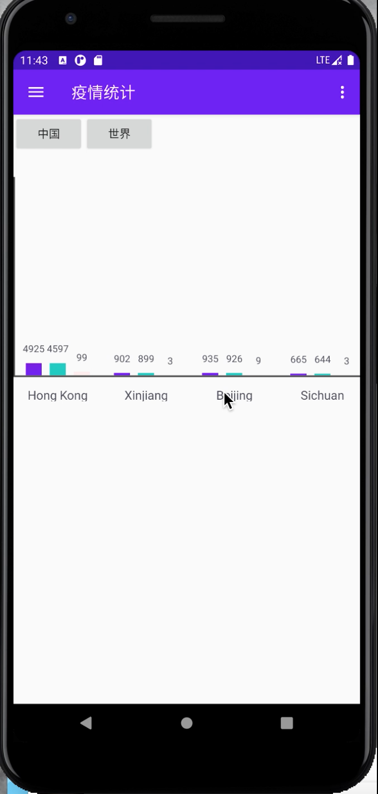
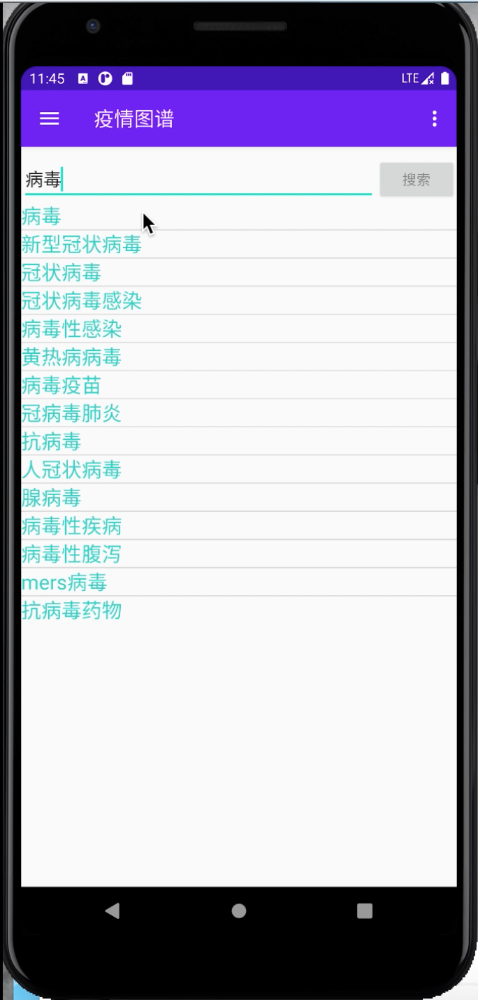
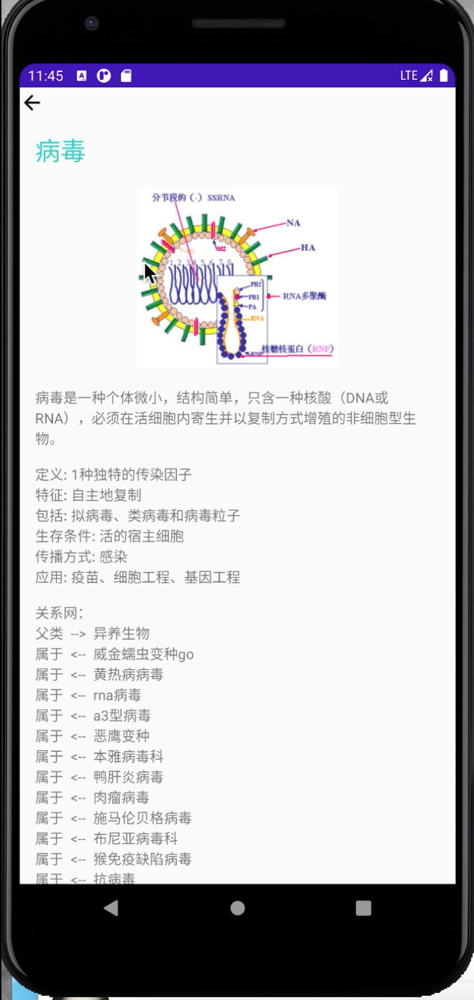
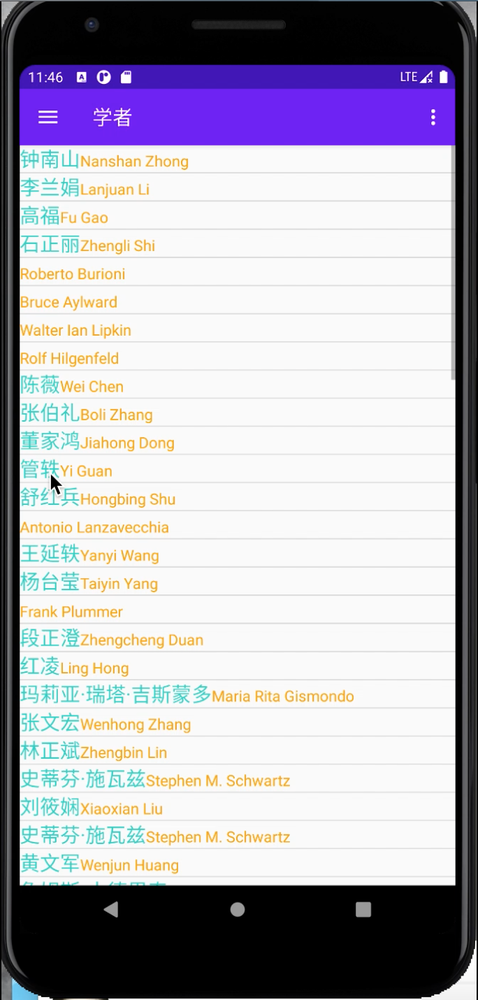
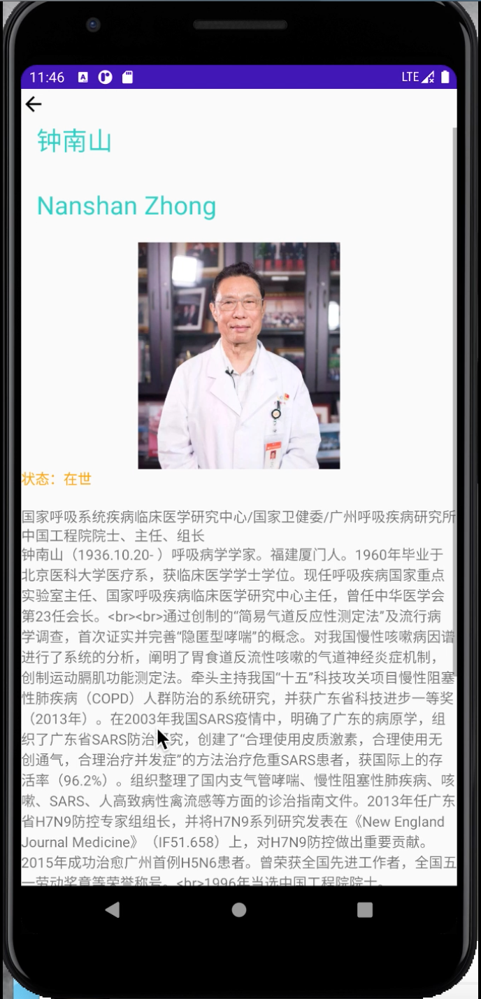

# COVID19-News App for Android

This project is an Android application about Covid19-News for the Tsinghua 20-Summer course "Java Program Design and Training".

Ziqi Wang is reponsible for the frontend and Aowei Lu is responsible for the backend.

## Functions

Like usual NewsApp, this App has several common functions:

- Search News(Include editting searching history)

- View news by categories(Include editting viewing history)

- Share news

There are also some special features for COVID-19:

- Statistical histogram of COVID-19(i.e. number of infecte, death, and cured people in different areas)

- Encyclopedia and knowledge graphs of COVID-19 related knowledge such as "Virus"

- Encyclopedia of pioneers in the fight against the COVID-19

## Usage

Import this project into **AndroidStudio**, and you can run this project on the simulator or your own Android phone.

You need to connect to the Internet in order to get COVID-19 news.

